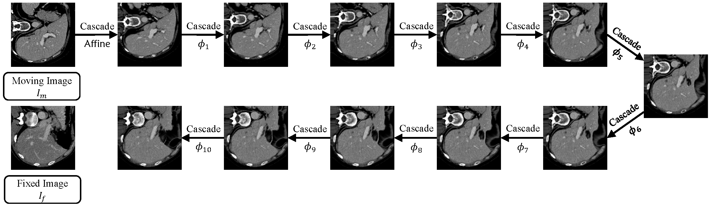
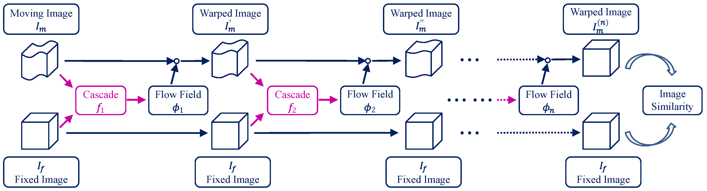

# Recursive Cascaded Networks for Unsupervised Medical Image Registration (ICCV 2019)

By Shengyu Zhao, Yue Dong, Eric I-Chao Chang, Yan Xu.

Paper link: [[arXiv]](https://arxiv.org/pdf/1907.12353)

## Introduction

We propose *recursive cascaded networks*, a general architecture that enables learning deep cascades, for deformable image registration. The proposed architecture is simple in design and can be built on any base network. The moving image is warped successively by each cascade and finally aligned to the fixed image; this procedure is recursive in a way that every cascade learns to perform a progressive deformation for the current warped image. The entire system is end-to-end and jointly trained in an unsupervised manner. Shared-weight techniques are developed in addition to the recursive architecture. We achieve state-of-the-art performance on both liver CT and brain MRI datasets for 3D medical image registration. For more details, please refer to our [paper](https://arxiv.org/pdf/1907.12353).





This repository includes:

* Training and testing scripts using Python and TensorFlow;
* Pretrained models using either [VTN](https://arxiv.org/pdf/1902.05020.pdf) or [VoxelMorph](https://arxiv.org/pdf/1809.05231.pdf) as the base network; and
* Preprocessed training and evaluation datasets for both liver CT scans and brain MRIs.

Code has been tested with Python 3.6 and TensorFlow 1.4.

If you use the code, the models, or our data in your research, please cite:

```
@inproceedings{zhao2019recursive,
  author = {Zhao, Shengyu and Dong, Yue and Chang, Eric I-Chao and Xu, Yan},
  title = {Recursive Cascaded Networks for Unsupervised Medical Image Registration},
  booktitle = {Proceedings of the IEEE International Conference on Computer Vision (ICCV)},
  year = {2019}
}
@article{zhao2019unsupervised,
  title = {Unsupervised 3D End-to-End Medical Image Registration with Volume Tweening Network},
  author = {Zhao, Shengyu and Lau, Tingfung and Luo, Ji and Chang, Eric I and Xu, Yan},
  journal = {IEEE Journal of Biomedical and Health Informatics},
  year = {2019},
  doi = {10.1109/JBHI.2019.2951024}
}
```

## Datasets

Our preprocessed evaluation datasets can be downloaded here:

* [SLIVER, LiTS, and LSPIG](https://drive.google.com/open?id=1xQMmYk9S8En2k_uavytuHeeSmN253jKo) for liver CT scans; and
* [LPBA](https://drive.google.com/open?id=19v5-qRF3KwA8Snf5ei-qtMv-nDYyXBzv) for brain MRIs.

If you wish to replicate our results, please also download our preprocessed training datasets:

* [MSD and BFH](https://drive.google.com/open?id=17IiuM74HPj1fsWwkAfq-5Rc6r5vpxUJF) for liver CT scans; and
* [ADNI, ABIDE, and ADHD](https://drive.google.com/open?id=1rJtP9M1N3lSjNzJ5kIzRrrwPe1bWCfXB) for brain MRIs.

Please unzip the downloaded files into the "datasets" folder. Details about the datasets and the preprocessing stage can be found in the paper.

## Pretrained Models

You may download the following pretrained models and unzip them into the "weights" folder.

For liver CT scans,

* [3-cascade VTN](https://drive.google.com/open?id=1uLb0mNxgvwWMxzNKvF1xVnnbgLlCjEfU)
* [10-cascade VTN](https://drive.google.com/open?id=1ECGIXccx2vhybrWff7DWW6keAjilEZcT)
* [5-cascade VoxelMorph](https://drive.google.com/open?id=1-p4AHHZKoMDIIg6Be5RK3h9QOeVpOPTA)

For brain MRIs,

- [3-cascade VTN](https://drive.google.com/open?id=14wFJZMnkk2SQXcWH3LQBxQJZhLWvsV3n)
- [10-cascade VTN](https://drive.google.com/open?id=1bvHG_g5NRS6Ek6aNEgMb9bIfYaCk62Mp)
- [5-cascade VoxelMorph](https://drive.google.com/open?id=1oSiHE2G4R5SuYtt6FVu_ayQ_t9UN3HgB)

## Evaluation

If you wish to test the pretrained [10-cascade VTN (for liver)](https://drive.google.com/open?id=1ECGIXccx2vhybrWff7DWW6keAjilEZcT) for example, please first make sure that the evaluation datasets for liver CT scans, [SLIVER, LiTS, and LSPIG](https://drive.google.com/open?id=1xQMmYk9S8En2k_uavytuHeeSmN253jKo), have been placed into the "datasets" folder. For evaluation on the SLIVER dataset (20 * 19 pairs in total), please run:

`python eval.py -c weights/VTN-10-liver -g YOUR_GPU_DEVICES`

For evaluation on the LiTS dataset (131 * 130 pairs in total, which might be quite slow), please run:

`python eval.py -c weights/VTN-10-liver -g YOUR_GPU_DEVICES -v lits`

For pairwise evaluation on the LSPIG dataset (34 pairs in total), please run:

`python eval.py -c weights/VTN-10-liver -g YOUR_GPU_DEVICES -v lspig --paired`

`YOUR_GPU_DEVICES` specifies the GPU ids to use (default to `0`), split by commas with multi-GPU support, or `-1` if CPU only. Make sure that the number of GPUs specified evenly divides the `BATCH_SIZE` that can be specified using `--batch BATCH_SIZE` (default to `4`). The proposed shared-weight cascading technique can be tested using `-r TIMES_OF_SHARED_WEIGHT_CASCADES` (default to `1`).

When the code returns, you can find the result in "evaluate/*.txt".

Similarly, to evaluate the pretrained [10-cascade VTN (for brain)](https://drive.google.com/open?id=1bvHG_g5NRS6Ek6aNEgMb9bIfYaCk62Mp) on the [LPBA](https://drive.google.com/open?id=19v5-qRF3KwA8Snf5ei-qtMv-nDYyXBzv) dataset:

`python eval.py -c weights/VTN-10-brain -g YOUR_GPU_DEVICES`

Please refer to our paper for details about the evaluation metrics and our experimental settings.

## Training

The following script is for training:

`python train.py -b BASE_NETWORK -n NUMBER_OF_CASCADES -d DATASET -g YOUR_GPU_DEVICES`

`BASE_NETWORK` specifies the base network (default to `VTN`, also can be `VoxelMorph`). `NUMBER_OF_CASCADES` specifies the number of cascades to train (not including the affine cascade), default to `1`.  `DATASET` specifies the data config (default to `datasets/liver.json`, also can be `datasets/brain.json`). `YOUR_GPU_DEVICES` specifies the GPU ids to use (default to `0`), split by commas with multi-GPU support, or `-1` if CPU only. Make sure that the number of GPUs specified evenly divides the `BATCH_SIZE` that can be specified using `--batch BATCH_SIZE` (default to `4`). Specify `-c CHECKPOINT` to start with a previous checkpoint.

## Built-In Warping Operation with TensorFlow

If you wish to reduce the GPU memory usage, we implemented a memory-efficient warping operation built with TensorFlow 1.4. A pre-built installer for Windows x64 can be found [here](https://drive.google.com/open?id=14n4oflK4Su_EkNaJSAMphSbKIpm9zK9R), which can be installed with `pip install tensorflow_gpu-1.4.1-cp36-cp36m-win_amd64.whl`. Please then specify `--fast_reconstruction` in the training and testing scripts to enable this feature. Otherwise, the code is using an alternative version of the warping operation provided by [VoxelMorph](https://github.com/voxelmorph/voxelmorph).

## Acknowledgement

We would like to acknowledge Tingfung Lau and Ji Luo for the initial implementation of VTN.